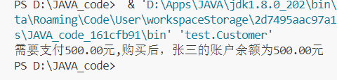
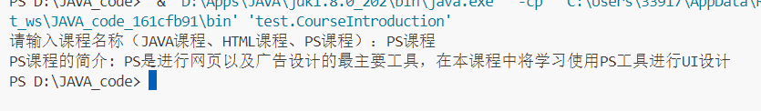

浙  江  农  林  大  学  数  计  学  院
JAVA程序设计实验报告


实 验 二:           类、对象与方法       
学生姓名:           刘糠杰               
专　  业:            智能科学与技术       
指导教师:            戴丹                 


完成日期  （ 2024年  9月 29 日）


一、实验任务
## 题目1
定义手机类，手机有品牌(brand),价格(price)和颜色(color)三个属性，有打电话call()和sendMessage()两个功能。
请定义出手机类，成员变量要被private修饰。类中要有空参、有参构造方法，set/get方法。 
定义测试类，在主方法中使用空参构造创建对象，使用set方法赋值。
调用对象的两个功能，打印效果如下：
```
正在使用价格为3998元黑色的小米手机打电话....
正在使用价格为3998元黑色的小米手机发短信....
```
### 实验代码
```java
package test;
import java.util.Scanner;

public class Object {
    public static void main(String[] args) {
        Scanner input = new Scanner(System.in);
        Phone phone = new Phone();

        System.out.println("请输入手机品牌: ");
        String brand = input.next();
        System.out.println("请输入手机价格: ");
        int price = input.nextInt();
        System.out.println("请输入手机颜色: ");
        String color = input.next();

        phone.set(brand, price, color);
        phone.call();
        phone.sendMessage();
        input.close();
    }
}
```
```java
package test;

public class Phone {
    private String brand;
    private double price;
    private String color;

    public Phone() {
        this.brand = "未知品牌";
        this.price = 0.00;
        this.color = "彩色";
    }
    public Phone(String brand, double price, String color) {
        this.brand = brand;
        this.price = price;
        this.color = color;
    }

    public void call() {
        System.out.printf("正在使用价格为%.2f元的%s的%s手机打电话...\n",this.price,this.color,this.brand);
    }
    public void sendMessage() {
        System.out.printf("正在使用价格为%.2f元的%s的%s手机发短信...\n",this.price,this.color,this.brand);
    }

    public void set(String brand,double price,String color) {
        this.brand = brand;
        this.price = price;
        this.color = color;
    }
    public String getBrand() {
        return this.brand;
    }
    public double getPrice() {
        return this.price;
    }
    public String getColor() {
        return this.color;
    }
}
```
### 运行结果
```
请输入手机品牌: 
小米
请输入手机价格: 
3998
请输入手机颜色: 
黑色
正在使用价格为3998.00元的黑色的小米手机打电话...
正在使用价格为3998.00元的黑色的小米手机发短信...
```

## 题目2
定义一个运动员类。运动员的属性包含：姓名，性别，身高，体重。行为包含：踢足球playFootball()，打篮球playBasketball()。另外定义一个用于展示四个属性值的show()方法。请在测试类中通过有参构造方法创建对象并赋值，然后分别调用SHOW方法、踢足球方法、打篮球方法。打印效果如下：
```
运动员叫姚明,身高190.0厘米,体重100.0公斤
运动员在踢足球
运动员在打篮球
```

### 训练提示
1. 类中的属性就是成员变量，类中的行为功能就是成员方法。
2. 成员变量要被private修饰。
3. 展示方法的作用就是打印姓名，性别，身高，体重四个成员变量的值。

### 实验代码
```java
package test;
import java.util.Scanner;

public class Object {
    public static void main(String[] args) {
        Scanner input = new Scanner(System.in);
        Player player = new Player("姚明", "男", 190, 100);
        player.showInfo();
        player.playFootball();
        player.playBasketball();
        input.close();
    }
}
```
```java
package test;

public class Player {
    private String name;
    private String sex;
    private double heiget;
    private double weight;

    public Player(String name, String sex,double heiget,double weight) {
        this.name = name;
        this.sex = sex;
        this.heiget = heiget;
        this.weight = weight;
    }
    

    public void showInfo() {
        System.out.printf("运动员叫%s,身高%.1f厘米,体重%.1f公斤\n",this.name,this.heiget,this.weight);
    }
    
    public void playFootball() {
        System.out.println(this.name+"正在打足球...");
    }
    public void playBasketball() {
        System.out.println(this.name+"正在打篮球...");
    }

}
```

### 运行结果
```
运动员叫姚明,身高190.0厘米,体重100.0公斤
姚明正在打足球...    
姚明正在打篮球...
```

## 题目3
定义项目经理类Manager。属性：姓名name，工号id，工资salary，奖金bonus。行为：工作work()
定义程序员类Coder。属性：姓名name，工号id，工资salary。行为：工作work()
要求：
	1.按照以上要求定义Manager类和Coder类,属性要私有,生成空参、有参构造，set和get方法
	2.定义测试类,在main方法中创建该类的对象并给属性赋值(set方法或有参构造方法)
	3.调用成员方法,打印格式如下:		
```
工号为123基本工资为15000奖金为6000的项目经理张三正在努力的做着管理工作,分配任务,检查员工提交上来的代码.....
工号为135基本工资为10000的程序员李四正在努力的写着代码......
```

### 实验代码
```java
package test;

// 项目经理类
class Manager {
    private String name; 
    private String id;   
    private double salary;
    private double bonus; 

    public Manager() {
    }

    public Manager(String name, String id, double salary, double bonus) {
        this.name = name;
        this.id = id;
        this.salary = salary;
        this.bonus = bonus;
    }

    public String getName() {
        return name;
    }

    public void setName(String name) {
        this.name = name;
    }

    public String getId() {
        return id;
    }

    public void setId(String id) {
        this.id = id;
    }

    public double getSalary() {
        return salary;
    }

    public void setSalary(double salary) {
        this.salary = salary;
    }

    public double getBonus() {
        return bonus;
    }

    public void setBonus(double bonus) {
        this.bonus = bonus;
    }

    public void work() {
        System.out.println("工号为" + id + "基本工资为" + salary + "奖金为" + bonus + "的项目经理" + name + "正在努力的做着管理工作,分配任务,检查员工提交上来的代码.....");
    }
}

// 程序员类
class Coder {
    private String name; 
    private String id;   
    private double salary; 

    public Coder() {
    }

    public Coder(String name, String id, double salary) {
        this.name = name;
        this.id = id;
        this.salary = salary;
    }

    public String getName() {
        return name;
    }

    public void setName(String name) {
        this.name = name;
    }

    public String getId() {
        return id;
    }

    public void setId(String id) {
        this.id = id;
    }

    public double getSalary() {
        return salary;
    }

    public void setSalary(double salary) {
        this.salary = salary;
    }

    public void work() {
        System.out.println("工号为" + id + "基本工资为" + salary + "的程序员" + name + "正在努力的写着代码......");
    }
}
```

```java
package test;
import java.util.Scanner;

public class Object {
    public static void main(String[] args) {
        Scanner input = new Scanner(System.in);

        Manager manager = new Manager("张三", "123", 15000, 6000);
        manager.work();

        Coder coder = new Coder("李四", "135", 10000);
        coder.work();
        
        input.close();
    }
}

```

### 运行结果
```
工号为123基本工资为15000.0奖金为6000.0的项目经理张三正在努力的做着管理工作,分配任务,检查员工提交上来的代码.....
工号为135基本工资为10000.0的程序员李四正在努力的写着代码......
```

## 题目4
定义猫类Cat。属性:毛的颜色color，品种breed。行为:吃饭eat()，抓老鼠catchMouse()
定义狗类Dog。属性:毛的颜色color，品种breed。行为:吃饭()，看家lookHome()
要求:
	1.按照以上要求定义Cat类和Dog类,属性要私有,生成空参、有参构造，set和get方法
	2.定义测试类,在main方法中创建该类的对象并给属性赋值(set方法或有参构造方法)
	3.调用成员方法,打印格式如下:
```
花色的波斯猫正在吃鱼.....
花色的波斯猫正在逮老鼠....
黑色的藏獒正在啃骨头.....
黑色的藏獒正在看家.....
```

### 实验代码
```java
package test;

// 猫类
class Cat {
    private String color;
    private String breed; 

    public Cat() {
    }

    public Cat(String color, String breed) {
        this.color = color;
        this.breed = breed;
    }

    public String getColor() {
        return color;
    }

    public void setColor(String color) {
        this.color = color;
    }

    public String getBreed() {
        return breed;
    }

    public void setBreed(String breed) {
        this.breed = breed;
    }

    public void eat() {
        System.out.println(color + "的" + breed + "正在吃鱼.....");
    }

    public void catchMouse() {
        System.out.println(color + "的" + breed + "正在逮老鼠....");
    }
}

// 狗类
class Dog {
    private String color; 
    private String breed; 

    public Dog() {
    }

    public Dog(String color, String breed) {
        this.color = color;
        this.breed = breed;
    }

    public String getColor() {
        return color;
    }

    public void setColor(String color) {
        this.color = color;
    }

    public String getBreed() {
        return breed;
    }

    public void setBreed(String breed) {
        this.breed = breed;
    }

    public void eat() {
        System.out.println(color + "的" + breed + "正在啃骨头.....");
    }

    public void lookHome() {
        System.out.println(color + "的" + breed + "正在看家.....");
    }
}
```
```java
package test;
import java.util.Scanner;

public class Object {
    public static void main(String[] args) {
        Scanner input = new Scanner(System.in);

        Cat cat = new Cat("花色", "波斯猫");
        cat.eat();
        cat.catchMouse();

        Dog dog = new Dog("黑色", "藏獒");
        dog.eat();
        dog.lookHome();

        input.close();
    }
}
```

### 运行结果
```
花色的波斯猫正在吃鱼.....
花色的波斯猫正在逮老鼠....
黑色的藏獒正在啃骨头.....
黑色的藏獒正在看家.....
```

## 题目5
定义客户类（Customer），客户类的属性包括：姓名、年龄、电话、余额、账号和密码；方法包括：付款。
 
定义 Customer 类，并添加姓名、余额、账号和密码等属性。
为 Customer 类添加付款方法。
在 Customer 中添加 main函数，在 main 函数中创建 Customer 对象，为对象属性赋值并调用付款方法。

### 实验代码
```java
package test;

public class Customer {
    String name;
    int age;
    String phone;
    double balance;
    String account;
    String password;

    void payment(double price){
        System.out.printf("需要支付%.2f元,购买后，%s的账户余额为%.2f元",price,this.name,this.balance-price);
        this.balance -= price;
    }

    public static void main (String[] args) {
        Customer c = new Customer();
        c.name = "张三";
        c.age = 25;
        c.phone = "13812345678";
        c.balance = 1000;
        c.account = "235251525";
        c.password = "123456";
        c.payment(500);
    }
}
```

### 运行结果
```
需要支付500.00元,购买后，张三的账户余额为500.00元
```


## 题目6
编写JAVA程序，定义类或者方法，根据用户输入课程名称，输出对应课程的简介，各门课程的简介见表

| 课程名称 | 课程简介 |  
| :----: | :----: |
| JAVA课程 | JAVA语言是目前最流行的编写语言，在本课程中将学习编写程序必备的知识 |  
| HTML课程 | HTML是构成网页的最主要语言，在本课程中将学习网页设计的基础知识 |  
| PS课程 | PS是进行网页以及广告设计的最主要工具，在本课程中将学习使用PS工具进行UI设计 |

### 实验代码
```java
package test;
import java.util.Scanner;

public class CourseIntroduction {

    public static void main(String[] args) {

        Scanner scanner = new Scanner(System.in);
        System.out.print("请输入课程名称（JAVA课程、HTML课程、PS课程）：");
        String courseName = scanner.nextLine();

        String introduction;
        if ("JAVA课程".equals(courseName)) {
            introduction = "JAVA语言是目前最流行的编写语言，在本课程中将学习编写程序必备的知识";
        } else if ("HTML课程".equals(courseName)) {
            introduction = "HTML是构成网页的最主要语言，在本课程中将学习网页设计的基础知识";
        } else if ("PS课程".equals(courseName)) {
            introduction = "PS是进行网页以及广告设计的最主要工具，在本课程中将学习使用PS工具进行UI设计";
        } else {
            introduction = "课程名称无效，请输入正确的课程名称。";
        }

        System.out.println(courseName + "的简介: " + introduction);

        scanner.close();
    }
}
```

### 运行结果
```
请输入课程名称（JAVA课程、HTML课程、PS课程）：PS课程
PS课程的简介: PS是进行网页以及广告设计的最主要工具，在本课程中将学习使用PS工具进行UI设计
```

二、实验方法及结果  
三、实验总结
